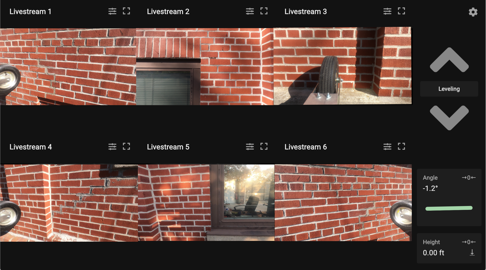

# Facade Inspection Robot UI

The following are the instructions for the operation of a facade inspection robot with this UI.

Check to make sure that the device running the UI is connected to same network as the Pis ("Imaging Router"). Upon connecting to the Pis, the following should be visible:

- 6 livestreams. Each of these can be viewed full screen, and brightness and contrast can be adjusted if necessary with the two buttons in each window's top right corner
- Angle of the beam (pitch) and the animation. This value should be zeroed while on the ground for maximum accuracy by clicking →0←. The bar turns from yellow to green when the frame is at an angle that triggers automatic leveling.
- Height from the ground or altitude. If using an altimeter instead of the rotary encoder, the sea level pressure at the time and place of operation (see local weather report) should be entered into the settings. The height from the ground can then be reset and zeroed by clicking →0←, and a log of heights and times throughout operation can be downloaded as a CSV file with <ins>↓</ins>.

### Hoist Control

- The rectangular button displaying "Leveling" or "Individual" can be clicked to toggle whether both hoists or a single hoist are run by the arrows.
- **Leveling** displays two arrows which are responsive to the up and down key being held down or the arrow icons being held down by a mouse. This mode operates both hoists at once to lift the entire frame and has a build in leveling algorithm which can be disabled/enabled in settings.
- **Individual** displays 4 arrows which are responsive to being held down by the mouse. This allows control of each individual hoist in both directions. The arrows on the left and right sides correspond to the left and right hoists when facing the wall the frame is on.

### Settings

Settings are accessible with the icon in the top right corner of the UI.

- **Time from ground** displays how much longer the robot has to move to reach the ground. A notification pops up when the frame is 5 sec off the ground
- **Total operation time** displays how long the hoist has been in operation
- **Maximum height** is an optional field for setting the max height the robot can reach before giving a warning.
- **Level in place** levels the frame with minimum vertical movement.
- **Disable leveling** can be toggled to turn the leveling algorithm off or on.

### Troubleshooting

If some parts of the UI aren't showing up, check to make sure that the IP addresses in the settings are the correct addresses of the Pis. This might require an IP network scanner. VNC Viewer also allows you to interface with the Raspberry Pis via a desktop UI through which specific problems and their sources can be identified.

If buttons are not responding properly, give the page a refresh. This is likely due to the Javascript event listeners failing to bind properly if they are disconnected from the start and are then reconnected. I've been trying to fix this but haven't been able to yet.
